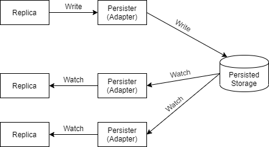

# RBAC Access Control Library in Golang

The rbac package provides [RBAC (Robe-Based Access Control)][rbac] in Golang. It is

- fast, even used with persisted data store, all reads are done in memory
- concurrent safe;
- coordinated in real-time among replicas;
- exported as very simple interfaces;
- designed to use any persisted storage as backend;
- limited to minimal external dependencies

This project is still in developing, and is not considered production ready.

## How it works

## Exported interfaces

### `Grouping`: Role assignment

- `Join(user, role)` assign a role to a subject: the subject can exercise a permission assigned to the role
- `Join(sub, role)` assign a higher-level role to a sub-role: roles can be combined in a hierarchy
- it also could be used to group objects together: article-category assignment
- subject-role, article-category groupings are both optional
- when neither of the two is used, RBAC works as [ACL(Access Control List)](https://en.wikipedia.org/wiki/Access-control_list)

### `Permission`: Permission assignment and authorization

- `Permit(subject, object, action)` assign a permission: a subject or subjects of a role can perform some action to an article or a category of articles
- `Shall(subject, object, action)` authorization: tell if a subject can perform an action to an article

### `Action`: Operations could be done to an object

- preset actions: read, write, execute
- custom actions could be registered through `types.ResetActions()`

### `Persister`s: Persist and coordinate rules among replica set

- store grouping and permission rules to a persisted storage to survive application restarts
- coordinate multiple replicas of the application works together: changes made by any replica will be send to others, and they will behave same as one

## Persisters

The Persister (adapter) does basically two things:

1. Write (grouping/permission) changes to the storage: Insert/Update/Remove
1. Watch the storage for changes made by other replicas

Changes made by current replica (and then be watched) will be ignored, implementations need not to care about them. All replicas will keep same rules in memory.

### Available persister implementations

Available persister implementations are listed as follow. PR for other implementations or references to other projects are welcome.

| package name                          | backend       | driver                                        | go doc                            |
| ------------------------------------- | ------------- | --------------------------------------------- | --------------------------------- |
| `github.com/houz42/rbac/persist/mgo`  | MongoDB (3.6) | [`github.com/globalsign/mgo`][mgo driver doc] | [![PkgGoDev][mgo badge]][mgo doc] |
| `github.com/houz42/rbac/persist/fake` | -             | -                                             | -                                 |

[rbac]: https://en.wikipedia.org/wiki/Role-based_access_control
[mgo driver doc]: https://pkg.go.dev/github.com/globalsign/mgo
[mgo badge]: https://pkg.go.dev/badge/github.com/houz42/rbac/persist/mgo
[mgo doc]: https://pkg.go.dev/github.com/houz42/rbac/persist/mgo
[fake doc]: https://pkg.go.dev/github.com/houz42/rbac@v0.2.0/persist/fake
